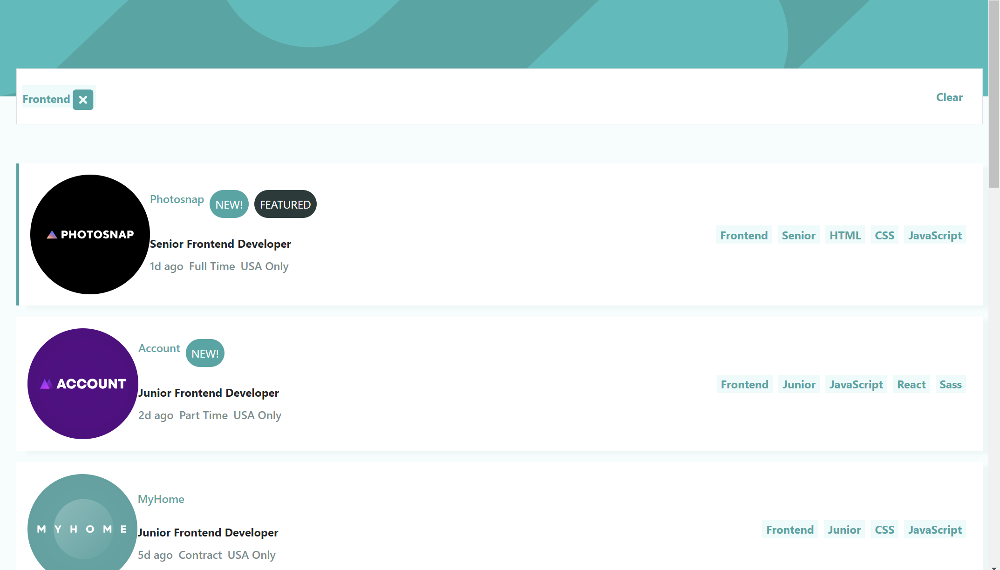

# Frontend Mentor - Job listings with filtering solution

This is a solution to the [Job listings with filtering challenge on Frontend Mentor](https://www.frontendmentor.io/challenges/job-listings-with-filtering-ivstIPCt). Frontend Mentor challenges help you improve your coding skills by building realistic projects. 

## Table of contents

- [Overview](#overview)
  - [The challenge](#the-challenge)
  - [Screenshot](#screenshot)
  - [Links](#links)
- [My process](#my-process)
  - [Built with](#built-with)
  - [What I learned](#what-i-learned)
  - [Continued development](#continued-development)
  - [Useful resources](#useful-resources)
- [Author](#author)


## Overview

### The challenge

Users should be able to:

- View the optimal layout for the site depending on their device's screen size
- See hover states for all interactive elements on the page
- Filter job listings based on the categories

### Screenshot



### Links

- Solution URL: [Github]()
- Live Site URL: [Live Github]()

## My process

### Built with

- Semantic HTML5 markup
- Sass/SCSS
- Bootstrap
- jQuery/Javascript
- Mobile-first workflow


### What I learned

- After first trying and failing to add input of type search everytime a user clicks the spacebar in the header by adding them using `elements.outerSearch.innerHTML += `<search class="outer-search">
	                      <label for='search-term${vars.searchId}' class='visually-hidden'>Search term ${vars.searchId}</label>
			              <input class='border me-3' type='search' id='search-term${vars.searchId}' name='searchterm-item'>
					</search>`;`
  I finally found a stackoverflow post explaining the use of insertAdjacentHTML and 'beforeend' (see link 1)
- I misunderstood the design at first and thought the search bar on top was where you'd enter search options 
  My old code was based on that : 

  ```
     function addSearch() {
	      vars.searchId=++vars.searchId;
	      const search = `<search class="outer-search me-1 me-md-3">
	                      <label for='search-term${vars.searchId}' class='visually-hidden'>Search term ${vars.searchId}</label>
			                  <input placeholder="Search" class='border' type='search' id='search-term${vars.searchId}' name='searchterm-item'>
					            </search>`;
	      elements.outerSearch.insertAdjacentHTML("beforeend", search );
     }

     $( "#outer-search" ).on( "keyup", function(event) {
	
	      if (event.code === 'Space') {
		        addSearch();
	      }
     });

  ```
  When I asked for clarification at discord they said that the design was to click the tabs on the listings and then the search terms appear on top
- I first use a separate function to return the JSON file languages or tools data in `addListings()`.
  Like so `<div class='d-flex'>${returnArray(item.languages)}</div>;`
  
  ```
    const returnArray=(which)=>{
	    const aArray=[];
	    for(let i=0;i<which.length;++i){
		    aArray.push(`<li class="nav-item"><a class="nav-link searchitem">${which[i]}</a></li>`);
	    }
      return aArray;
    }
    
  ```
  But then `addListings()` added the backticks .
  I found a stackoverflow post that explainded how to do this better using `map()`(see link 2)
- I also could use some pointers from a stackoverflow post how to add a listener to each close button for selected search terms , in order to avoid having to add a `querySelectorAll()`  after each search term is added to `<output>`, which is probably not the most efficient, instead I could simply make us of data attributes (see link 3).
- I wanted to 'short circuit' `forEach()` in `filterData()`, as as soon as a term is found in a listing, that listing should be included and there's no need to continue to assess that listing. And found a stackoverflow post that explained the use of `some()` instead, which returns true as soon as any of the callbacks, executed in array order, return true, short-circuiting the execution of the rest (see link 4). But then, I realized it only will return the first result then, and that was still not what I had I mind. I did realize I could keep the rest of my `some()` code with the returns on true, and just switch back to `forEach()` for the elements array.
- I also read up online about ensuring dynamically added HTML is accessible. 
- I had trouble getting the first paint to load at a good speed appearantly as ,initially, the frontendmentor project screenshot didn't look right with no loaded job listings. I asked for help , as to why this was happening, at Discord , they mentioned the use of Lighthouse and how it will identify problems with a site. 

  
 
### Continued development

- Daily tutorials and projects in HTML5, CSS3, Javascript, Bootstrap, Sass/SCSS. For now, in time I will go re-learn React ect.

### Useful resources
[preserve input values after dynamically adding elements](https://stackoverflow.com/questions/30798315/preserve-input-values-after-dynamically-adding-an-input-field)
[template literals to insert iterated array values](https://stackoverflow.com/questions/50574786/simple-javascript-template-literals-to-insert-iterated-values-e-g-array-elemen)
[addEventListener to button inside template literal](https://stackoverflow.com/questions/53556671/add-event-listener-to-button-inside-template-literal)
[shortciruit forEach](https://stackoverflow.com/questions/2641347/short-circuit-array-foreach-like-calling-break)

## Author

- Website - [One of my latest codepens](https://codepen.io/cynthiab72/pen/oNybYON)
- Frontend Mentor - [@cmb347827](https://www.frontendmentor.io/profile/cmb347827)

